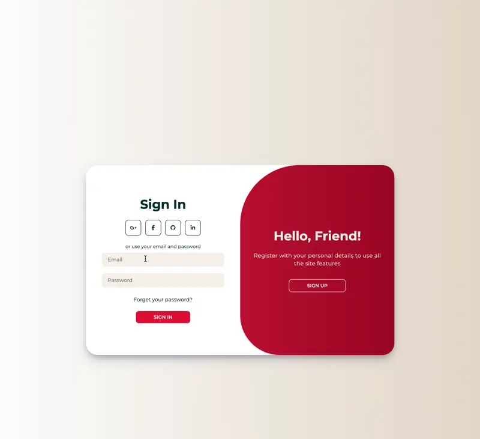

## Login & Registration Page

This project consists of a login and registration page developed using HTML, CSS, and JavaScript. It provides an intuitive and appealing interface for users to either create a new account or login to an existing one.

### Key Features

- **User-friendly Interface**: The page offers a clean and intuitive interface for seamless user interaction.

- **Account Registration**: Users can easily create a new account by providing their name, email, and password.

- **Login Functionality**: Existing users can log in by entering their email and password.

- **Social Media Integration**: The option to register or log in using social media accounts such as Google, Facebook, GitHub, and LinkedIn is included, enhancing user convenience.

- **Dynamic Interface**: The page features smooth animations and transitions when toggling between the registration and login forms, improving user experience.

### Technologies Used

The project was developed using the following technologies:

- **HTML and CSS**: For the structure, design, and styling of the web page.
- **JavaScript**: For client-side interaction logic, DOM manipulation, and event handling.

### Usage and Operation

1. Open the `index.html` file in your preferred web browser to access the login and registration page.
2. Fill in the necessary fields to create a new account or log in with an existing account.
3. You can also use the social media login options for quick and convenient access.

Explore the login and registration page to access all its functionalities and features!
